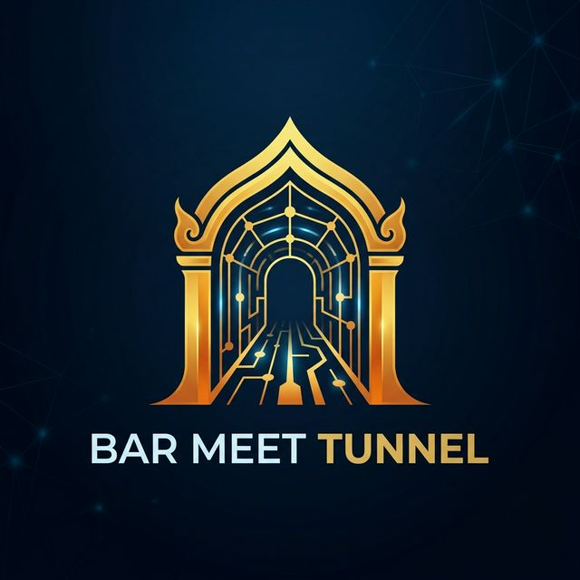
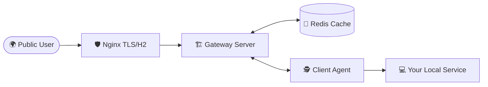

<p align="center">
  
</p>

# 🌌 Bar Meet Tunnel

<p align="center">
  
  
  
  
  <br>
  
</p>

**Pro-Level HTTP/2 Tunneling.** Create and access your own secure tunnel, built from scratch with Go, Redis, and Nginx.

---

## 🏗️ Architecture



- **Gateway Server**: Core logic for routing public traffic to agents.
- **Client Agent**: Connects your local server to the Gateway.
- **Redis Session Mapping**: Fast, scalable mapping of `subdomain -> agent_id`.
- **Nginx & TLS**: Professional-grade security with HTTP/2 termination.

## 🚀 Getting Started

### 1. Prerequisites
- Docker & Docker Compose
- Go 1.25.0+ (Latest security patched)

### 2. Launch Infrastructure
```bash
# In the project root:
docker-compose up -d
```
This starts the **Gateway**, **Redis**, and **Nginx**.

### 3. Run the Agent (Local Machine)
Connect your local service (default: `localhost:8080`) to the tunnel:
```bash
cd agent
go run main.go
```

### 🌍 Access Your Tunnel
Requests to `bar-meet-app.tunnel.com` will now stream directly to your local machine!

---

## 💎 Features
- ✅ **HTTP/2 Multiplexing**: High efficiency, low latency through persistent connections.
- ✅ **Secure TLS**: Nginx-powered SSL termination with modern protocols.
- ✅ **Redis Backed**: Persistent and scalable session management with automated heartbeat.
- ✅ **Pro-Level Standards**: Architecture designed for scalability and clean code.

## 🛡️ Security Audit
This project has been audited for common tunnel vulnerabilities:
- **Regex Subdomain Validation**: Prevents host-header/subdomain injection.
- **Path Traversal Protection**: Uses `path.Clean()` to prevent escaping local service boundaries.
- **SSRF Mitigation**: Strict proxy URL construction using `net/url`.
- **Dependency Guard**: Regularly updated with latest security patches for `x/net` and `x/sys`.

---

## 📄 License
This project is licensed under the [MIT License](LICENSE).

"Secure Local Access, Redefined."
