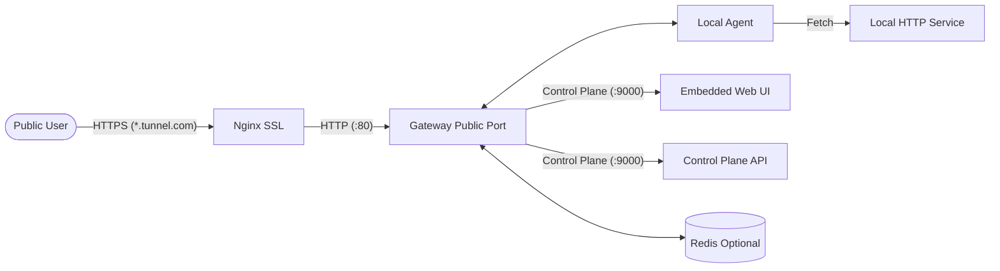

<p align="center">
  
</p>

# 🚀 Bar Meet Tunnel

A high-performance, **Ngrok-style** HTTP tunnel built in Go with an integrated **Traffic Inspector UI**.

[](https://go.dev/)
[](https://opensource.org/licenses/MIT)

## ✨ Core Features

- **⚡ Instant Public Access**: Tunnel local HTTP services to the internet securely.
- **🛡️ Built-in Control Plane**: A centralized gateway to manage active tunnels.
- **👁️ Traffic Inspector**: Real-time logging and deep inspection of request/response bodies.
- **🔄 Request Replay**: One-click replay of captured traffic for rapid testing and debugging.
- **📦 Multi-Environment**: Runs as a binary or within Docker with Redis support.
- **🔒 Optional Persistence**: Seamlessly switches between in-memory and Redis for tunnel state management.

---

## 🏗️ Architecture



---

## 🚦 Getting Started

### 1. Local Development

#### Start the Gateway
The gateway manages the control plane and handles incoming public traffic.

```bash
go run ./gateway
```

#### Run the Agent
The agent connects your local service to the gateway.

```bash
# Set your environment variables
export AGENT_ID="my-local-agent"
export SUBDOMAIN="my-awesome-app"
export LOCAL_HOST="http://127.0.0.1:8080"
export GATEWAY_WS="ws://127.0.0.1:9000/agent/connect"

go run ./agent
```

### 2. Docker Deployment

Start the entire stack (Gateway + Redis + Nginx) with one command:

```bash
docker compose up --build
```

> [!IMPORTANT]
> **Nginx with SSL**: Ensure you have valid certificate files at `./certs/fullchain.pem` and `./certs/privkey.pem` before starting Nginx.

---

## 🔧 Configuration

### Gateway Environment Variables

| Variable | Default | Description |
| :--- | :--- | :--- |
| `PUBLIC_ADDR` | `:80` | Port for incoming public HTTP traffic. |
| `CONTROL_ADDR` | `:9000` | Port for the control plane (Agent connection + API + UI). |
| `REDIS_URL` | `localhost:6379` | Redis address for persistent tunnel registration. |

### Agent Environment Variables

| Variable | Default | Description |
| :--- | :--- | :--- |
| `AGENT_ID` | `hostname-pid` | Unique identifier for your agent. |
| `SUBDOMAIN` | `bar-meet-app` | The public subdomain requested (e.g., `app.tunnel.com`). |
| `LOCAL_HOST` | `http://localhost:8080` | The address of your local HTTP service. |
| `GATEWAY_WS` | `ws://localhost:9000/...` | The WebSocket URL of the gateway control plane. |

---

## 🛠️ Testing Traffic

### 1. Start a mock server

```bash
python3 -c "from http.server import BaseHTTPRequestHandler, HTTPServer; import json; [type('H', (BaseHTTPRequestHandler,), {'do_GET': lambda s: (s.send_response(200), s.send_header('Content-Type', 'application/json'), s.end_headers(), s.wfile.write(json.dumps({'status':'ok', 'path':s.path}).encode())), 'do_POST': lambda s: (s.send_response(200), s.send_header('Content-Type', 'application/json'), s.end_headers(), s.wfile.write(json.dumps({'status':'received', 'body':s.rfile.read(int(s.headers.get('Content-Length',0))).decode('utf-8')}).encode()))})(('127.0.0.1', 8080), H).serve_forever()]"
```

### 2. Send traffic through the Gateway

```bash
curl -H 'Host: my-awesome-app.tunnel.com' http://127.0.0.1/hello
```

### 3. Deep Inspect in UI

Open **[http://127.0.0.1:9000/ui](http://127.0.0.1:9000/ui)** to:
- See active agent sessions and throughput.
- Inspect request/response headers and JSON/HTML/Text bodies.
- Trigger **Request Replay** for debugging.

---

## 📡 Control Plane API

| Endpoint | Method | Description |
| :--- | :--- | :--- |
| `/api/tunnels` | `GET` | Lists all active agent connections and stats. |
| `/api/requests` | `GET` | Lists captured traffic records (filtered by `?tunnel=subdomain`). |
| `/api/requests/:id` | `GET` | Returns full details of a specific traffic record. |
| `/api/requests/:id/replay` | `POST` | Replays the specified request against the active agent. |
| `/healthz` | `GET` | Liveness and readiness probe. |

---

## 🔒 Proxy Headers

The agent injects the following headers into requests forwarded to your local service:

| Header | Description |
| :--- | :--- |
| `X-Forwarded-For` | The public IP address of the original client. |
| `X-Forwarded-Host` | The original `Host` header sent by the client. |
| `X-Tunnel-Subdomain` | The subdomain assigned to this tunnel. |
| `X-Bar-Meet-Replay-Of` | Only present on replayed requests, contains the original request ID. |

---

## 📝 Operating Limits

- **Body Size**: Requests and response bodies are capped at **10 MiB**.
- **History Retention**: Traffic logs are kept in-memory, capped at the latest **250 records**.
- **Timeout**: Agent communication times out after **60 seconds**.
- **Persistence**: If Redis is unavailable, the system automatically falls back to **in-memory** session tracking.

---

## 📜 License

Distributed under the **MIT** License. See `LICENSE` for more information.
