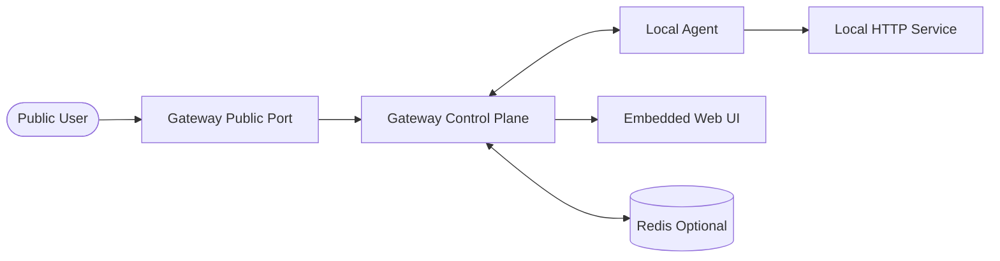

<p align="center">
  
</p>

# Bar Meet Tunnel

Ngrok-style HTTP tunnel in Go with an embedded control UI.

## What It Does

- Public HTTP requests route through the gateway to a connected agent over WebSocket.
- The agent forwards each request to your local service and sends the response back to the gateway.
- The control server exposes a Web UI for:
  - active tunnels
  - captured traffic logs
  - request replay

## Architecture



## Default Ports

- Public traffic: `:80`
- Control plane and Web UI: `:9000`

## Deploy

### Option 1: Local deploy

Run the gateway:

```bash
go run ./gateway
```

Run the agent on the machine that can reach your local app:

```bash
AGENT_ID=my-agent \
SUBDOMAIN=bar-meet-app \
LOCAL_HOST=http://127.0.0.1:8080 \
GATEWAY_WS=ws://127.0.0.1:9000/agent/connect \
go run ./agent
```

Open the control UI:

```text
http://127.0.0.1:9000/ui
```

### Option 2: Docker deploy

Start the infrastructure:

```bash
docker compose up --build
```

What starts:

- `gateway` on `:80` and `:9000`
- `redis` on `:6379`
- `nginx` on `:443`

Important notes:

- `nginx` requires valid cert files in `./certs/fullchain.pem` and `./certs/privkey.pem`
- the agent still runs outside the Compose stack unless you add it as another service
- if you only want the gateway and Redis, you can run `docker compose up --build gateway redis`

### Production deployment notes

- Point your wildcard DNS, for example `*.tunnel.example.com`, to the gateway host.
- Put TLS in front of the public port with nginx, Caddy, or a load balancer.
- Expose the control port only to trusted users. The current Web UI and API do not have authentication yet.
- Redis is optional in the current single-node setup, but useful if you want tunnel registration state outside process memory.

## Test

### 1. Start a local HTTP app

```bash
python3 - <<'PY'
from http.server import BaseHTTPRequestHandler, HTTPServer
import json

class Handler(BaseHTTPRequestHandler):
    def _send(self):
        length = int(self.headers.get("Content-Length", "0") or "0")
        body = self.rfile.read(length) if length else b""
        payload = {
            "method": self.command,
            "path": self.path,
            "body": body.decode("utf-8", "replace"),
            "forwarded_host": self.headers.get("X-Forwarded-Host"),
            "replay_of": self.headers.get("X-Bar-Meet-Replay-Of"),
        }
        data = json.dumps(payload).encode()
        self.send_response(200)
        self.send_header("Content-Type", "application/json")
        self.send_header("Content-Length", str(len(data)))
        self.end_headers()
        self.wfile.write(data)

    do_GET = _send
    do_POST = _send

HTTPServer(("127.0.0.1", 8080), Handler).serve_forever()
PY
```

Or run your own app on `http://127.0.0.1:8080`.

### 2. Start the gateway

```bash
go run ./gateway
```

### 3. Start the agent

```bash
AGENT_ID=my-agent \
SUBDOMAIN=bar-meet-app \
LOCAL_HOST=http://127.0.0.1:8080 \
GATEWAY_WS=ws://127.0.0.1:9000/agent/connect \
go run ./agent
```

### 4. Send traffic through the tunnel

```bash
curl -H 'Host: bar-meet-app.tunnel.com' http://127.0.0.1/hello
```

If you want to test a POST request:

```bash
curl \
  -X POST \
  -H 'Host: bar-meet-app.tunnel.com' \
  -H 'Content-Type: application/json' \
  -d '{"ping":"pong"}' \
  http://127.0.0.1/api/test
```

### 5. Inspect in the Web UI

Open:

```text
http://127.0.0.1:9000/ui
```

You should see:

- the active tunnel in the left panel
- captured traffic logs in the center panel
- request and response details in the inspector

### 6. Replay a request

Use either the replay button in the UI or the API directly:

```bash
curl -X POST http://127.0.0.1:9000/api/requests/req-1/replay
```

This creates a new traffic record linked to the original request through `replay_of`.

### 7. Verify the API directly

List active tunnels:

```bash
curl http://127.0.0.1:9000/api/tunnels
```

List captured requests:

```bash
curl http://127.0.0.1:9000/api/requests
```

Fetch one request:

```bash
curl http://127.0.0.1:9000/api/requests/req-1
```

### 8. Run build and test checks

```bash
go test ./...
go build ./...
```

## Environment Variables

Gateway:

- `PUBLIC_ADDR` default `:80`
- `CONTROL_ADDR` default `:9000`
- `REDIS_URL` default `localhost:6379`

Agent:

- `AGENT_ID`
- `SUBDOMAIN`
- `LOCAL_HOST`
- `GATEWAY_WS`

## Notes

- Redis is optional for the current single-node setup. If Redis is unavailable, the gateway falls back to in-memory session tracking.
- Traffic capture is currently in-memory only. Restarting the gateway clears the request history.
- Request and response bodies are capped at `10 MiB` per exchange.

## Docker

The gateway Dockerfile builds the current Go codebase. The included `docker-compose.yml` still wires Redis and nginx, but you need valid TLS certs under `./certs` before nginx can start.

## License

MIT
